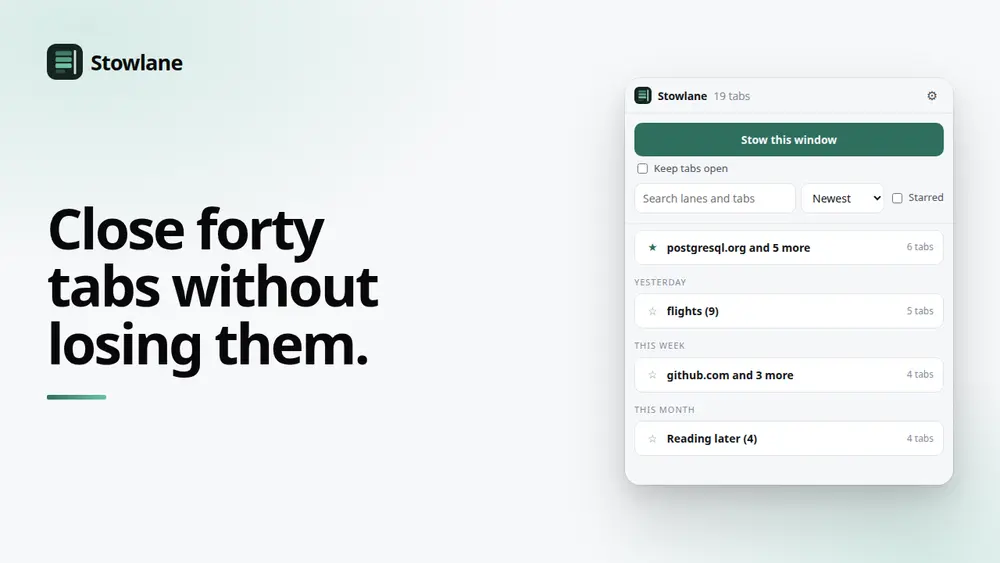
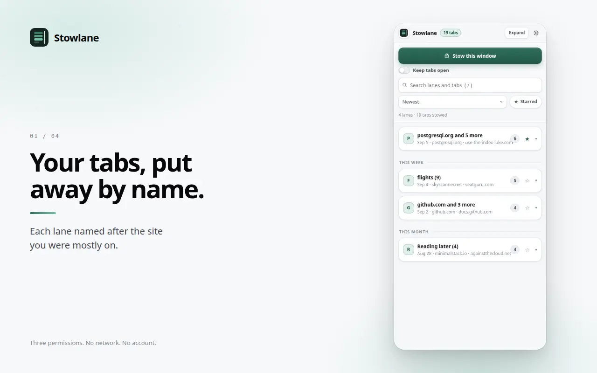
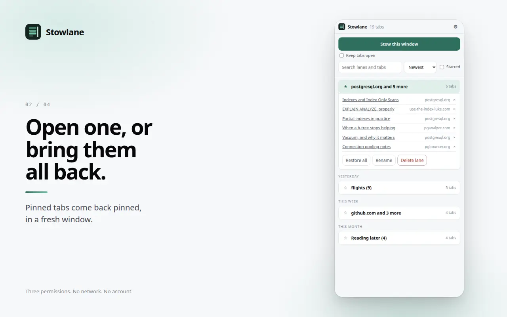
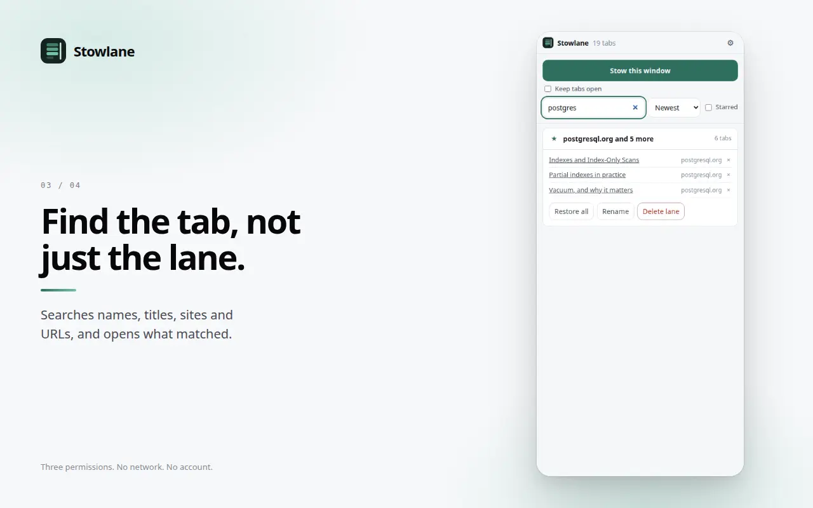
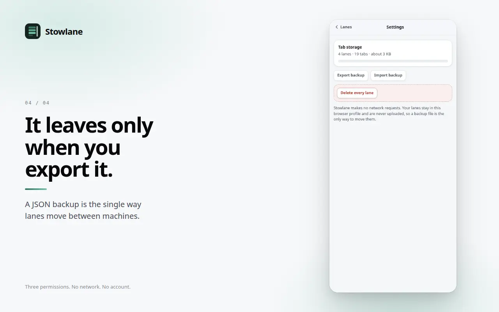

# Stowlane

Close forty tabs without losing them. Stow a window into a named lane, bring it
back whenever. No account, no sync, and the extension makes no network requests.

[](https://github.com/royalpinto007/Stowlane/actions/workflows/ci.yml)
[](LICENSE)
[](manifest.json)
[](#how-it-works)

<!-- media:start -->

<p align="center">
  
</p>

<h3 align="center">Close forty tabs without losing them.</h3>

<p align="center">
  <a href="docs/media/demo.mp4">
    
  </a>
  <br>
  <a href="docs/media/demo.mp4"><b>Watch the 30 second demo</b></a>
</p>

## Screenshots



<sub>Your tabs, put away by name.</sub>

<details>
<summary><b>See 3 more</b></summary>

### Open



<sub>Open one, or bring them all back.</sub>

### Search



<sub>Find the tab, not just the lane.</sub>

### Settings



<sub>It leaves only when you export it.</sub>

</details>

<sub>Every screenshot is captured from the real extension running in Chrome, not
mocked up, so they cannot drift from what the product actually does. Regenerate
them with the tooling in the store-publishing workspace.</sub>

<!-- media:end -->

## What it does

Press <kbd>Alt</kbd>+<kbd>Shift</kbd>+<kbd>L</kbd> and the window's tabs go into
a lane, named after whatever site you were mostly on. The window clears. The
tabs are still there when you want them.

- **Named automatically.** "github.com and 4 more" beats "22 tabs, 14 March"
  when you are looking for a lane a week later.
- **Search inside lanes.** By lane name, page title, site or URL. Matching lanes
  expand so you can see which tab it found.
- **Star the ones you keep.** Starred lanes stay at the top whatever the sort.
- **Restore all, or open one tab.** Pinned tabs come back pinned.
- **Expand all and counts.** One click opens every lane, with tab counts and a
  totals line. Press `/` to jump to search.
- **Backup.** Export to JSON, import it on another machine.

## Why it exists

Tab managers sync to an account, which means they need a connection and a
company. Stowlane is a list in your own browser profile. A backup file is the
only way it leaves.

## Privacy

Stowlane makes **no network requests**. There is no backend, no analytics, no
telemetry and no account. Check it yourself:

```bash
npm run build
grep -rE "fetch\(|XMLHttpRequest|WebSocket|sendBeacon" dist/
```

That returns nothing, and CI fails the build if it ever stops doing so.

Full policy: <https://privacy.signalizeai.org/stowlane>

## Permissions

Three, and that is the whole list.

| Permission  | Why                                                                  |
| ----------- | -------------------------------------------------------------------- |
| `tabs`      | Read the titles and URLs of the tabs you are stowing, and close them |
| `storage`   | Keep your lanes on this device                                       |
| `sidePanel` | The interface                                                        |

No host permissions at all. Stowlane never injects anything into a page and
never reads page content: it only sees what Chrome reports about a tab.

## How it works

```
Alt+Shift+L  or  Stow this window
        │
        ▼
service worker ── reads tab titles and URLs ──▶ chrome.storage.local
        │                                              │
        └── closes what it saved (after the write)     ▼
                                          side panel: lanes, search, restore
```

Two decisions worth knowing:

**The write happens before the close.** Losing tabs because a save failed
quietly is the one unforgivable bug in a tool like this, so nothing is closed
until storage has confirmed.

**One tab is always left behind.** Closing every tab in a window closes the
window, which takes the side panel with it and looks like a crash.

**Storage is `chrome.storage.local`, not IndexedDB.** A lane holds a URL, a
title and a hostname per tab, so a thousand stowed tabs sits well under a
megabyte and fits comfortably in the roughly 10MB available without the
`unlimitedStorage` permission. (Pagefold, which stores whole article bodies,
had to go the other way for exactly the opposite reason.)

## Install from source

```bash
npm ci
npm run build
```

Then open `chrome://extensions`, enable Developer mode, choose Load unpacked
and select this folder.

## Development

| Command                | What it does                                              |
| ---------------------- | --------------------------------------------------------- |
| `npm run build`        | Typecheck, then bundle both entry points into `dist/`     |
| `npm test`             | Unit tests for lane naming, search, formatting and backup |
| `npm run typecheck`    | `tsc --noEmit`                                            |
| `npm run format:check` | Prettier                                                  |

The logic that decides how the product feels is pure and tested: lane naming,
deduplication, search ranking, relative dates and backup parsing. The parts
needing a browser are verified by loading the built extension into a real
Chrome and stowing and restoring actual tabs.

## Contributing

See [CONTRIBUTING.md](./CONTRIBUTING.md).

## License

[MIT](./LICENSE)
